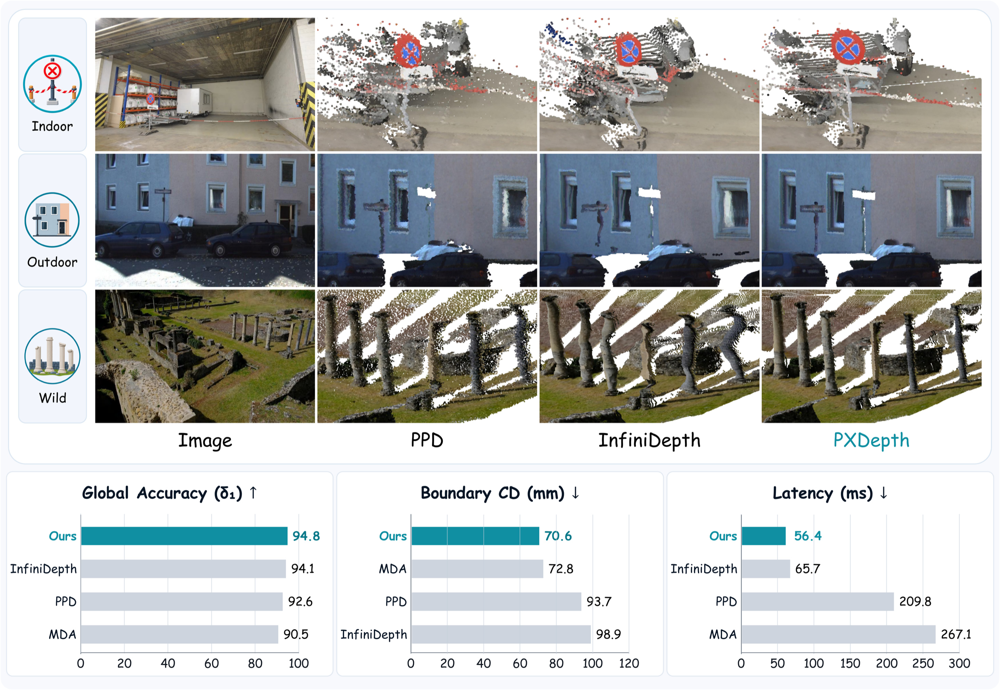

<div align="center">

<h1>PXDepth: Pixel-Space Modeling for Structure Preserving<br>Monocular Depth Estimation</h1>

<p>
  <a href="https://github.com/yuanzhy29">Zhiyuan Yuan</a>&emsp;
  <a href="https://guanyingc.github.io/">Guanying Chen</a><sup>*</sup>&emsp;
  <a href="https://lingtengqiu.github.io/">Lingteng Qiu</a>&emsp;
  <a href="http://zhangruimao.site/">Ruimao Zhang</a>&emsp;
  <a href="https://scholar.google.com.hk/citations?user=1o_qvR0AAAAJ&hl=en">Shuguang Cui</a>&emsp;
  <a href="https://scholar.google.com/citations?user=PDgp6OkAAAAJ&hl=en">Xiaochun Cao</a>
</p>

<a href="https://drive.google.com/file/d/1xdIs63FJgJBosRtNSmEhu7r0V_rdzQkO/view?usp=sharing"></a>
<a href="https://yuanzhy29.github.io/PXDepth-Page/"></a>
<a href="https://huggingface.co/yuanzhy29/PXDepth"></a>

</div>

<p align="center">
  
</p>

<div align="center">
PXDepth separates global context encoding from pixel-space depth prediction, using a Global Context Encoder and a Pixel-Space Depth Predictor.
</div>

## 🚀 Quick Start

### Installation

```bash
git clone https://github.com/yuanzhy29/PXDepth.git
cd PXDepth
conda create -n pxdepth python=3.11 -y
conda activate pxdepth
pip install torch==2.11.0 torchvision==0.26.0 torchaudio==2.11.0 --index-url https://download.pytorch.org/whl/cu128 # Use your preferred version if needed.
pip install -r requirements.txt
```

### Checkpoints

Download our [pretrained model](https://huggingface.co/yuanzhy29/PXDepth/tree/main) under the `checkpoints/` directory. In addition, [MoGe-2](https://huggingface.co/Ruicheng/moge-2-vitl-normal) is required to recover metric scale for point cloud reconstruction. Your files should be organized as follows:

```text
checkpoints/
├── pxdepth/
│   └── model.pt
└── moge-2-vitl-normal/
    └── model.pt
```

## 🔍 Inference

Run inference on one image or all images under a directory:

```bash
python scripts/infer.py \
  --input example_images \
  --output output \
  --checkpoint checkpoints/pxdepth/model.pt \
  --fp16
```

Each image produces:

```text
output/<image-name>/
├── image.jpg
├── depth.png
├── mask.png
└── points.ply
```

Use `--fp32` instead of `--fp16` for full-precision inference. Run `python scripts/infer.py --help` for all options.

## 📊 Evaluation

Download MoGe Benchmark from
[Hugging Face](https://huggingface.co/datasets/Ruicheng/monocular-geometry-evaluation/tree/main),
then extract them under `data/eval`.

Update the enabled dataset paths in [configs/eval/all_benchmarks.json](configs/eval/all_benchmarks.json). Remove entries for datasets that are not available locally.

Converters for 7Scenes, NRGBD, HiRoom, and Synth4K are included under
`dataset_preprocess/eval`. See
[dataset_preprocess/README.md](dataset_preprocess/README.md) for commands and
the expected raw and processed layouts.

Run evaluation:

```bash
python scripts/eval.py \
  --checkpoint checkpoints/pxdepth/model.pt \
  --config configs/eval/all_benchmarks.json \
  --output results/pxdepth.json \
  --fp16 \
  --dump-pred
```

See [docs/EVALUATION.md](docs/EVALUATION.md) for output files and optional flags.

## 🚧 TODO

- [x] Release model, inference, and evaluation code
- [X] Release our pretrained checkpoint
- [x] Release preprocessing for evaluation datasets
- [ ] Release training code and training configurations
- [ ] Release training-dataset preprocessing code

## 📚 Documentation

- [Evaluation](docs/EVALUATION.md)
- [Evaluation dataset preprocessing](dataset_preprocess/README.md)

## 📝 Citation

```bibtex
```

## 🙏 Acknowledgements

This repository builds on [MoGe](https://github.com/microsoft/moge), [DINOv2](https://github.com/facebookresearch/dinov2), [PixelDiT](https://github.com/NVlabs/PixelDiT), and [utils3d](https://github.com/EasternJournalist/utils3d). Thanks for these excellent contributions!
